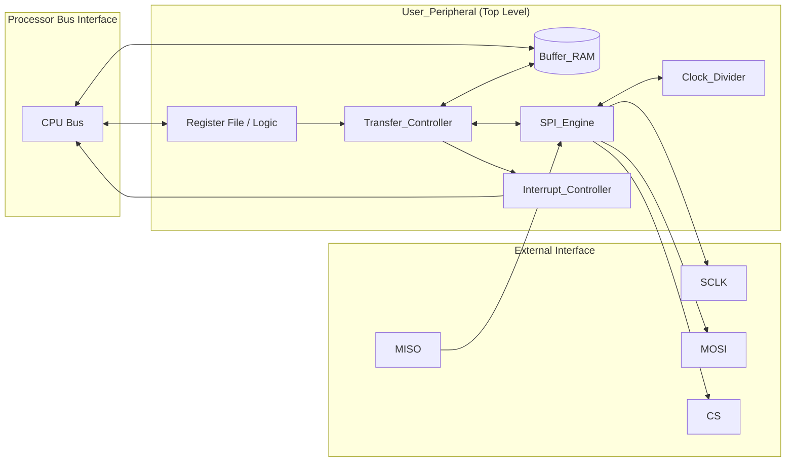
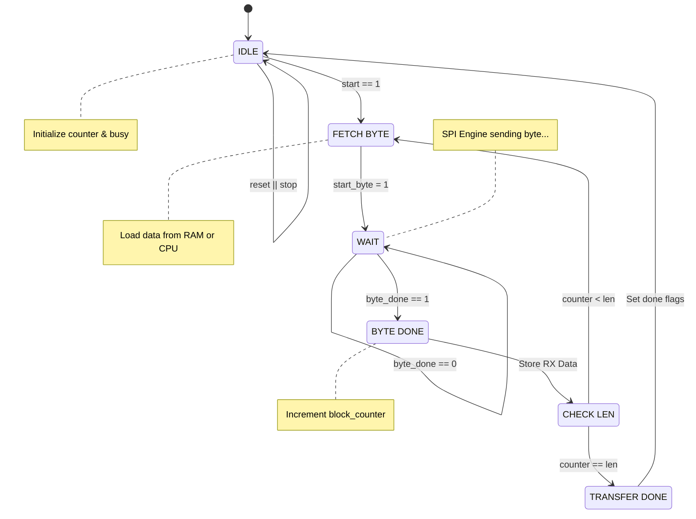

# SPI User Peripheral Documentation

| Address Range | Description | Access Type |
| :--- | :--- | :--- |
| **0x000 - 0x1FF** | Memory Mapped Registers | Word Aligned |
| **0x200 - 0xA00** | TX Buffer RAM | Byte/Half/Word |

---

## Register Map

| Offset | Name | Type | Description |
| :--- | :--- | :--- | :--- |
| `0x000` | **CONTROL** | WO | Trigger pulses for Start, Stop, and Mode selection. |
| `0x004` | **STATUS** | RO/W1C | Read status flags; Write any value to clear IRQs. |
| `0x008` | **CONFIG** | RW | SPI Clock polarity, phase, and clock divider. |
| `0x00C` | **CS** | RW | Manual Chip Select control. |
| `0x010` | **TXDATA** | RW | Data to be transmitted in manual mode. |
| `0x014` | **RXDATA** | RO | Last received byte. Reading clears `rx_valid_flag`. |
| `0x018` | **BLOCK_LEN**| RW | Number of bytes to transfer in Block Mode. |
| `0x01C` | **IRQ_ENABLE**| RW | Interrupt mask for done and error events. |

---

## Register Descriptions

### CONTROL (Offset: 0x000)
*Writing to this address generates single-cycle pulses. It does not store data.*

| Bit | Name | Description |
| :--- | :--- | :--- |
| 0 | **START** | Pulses the SPI engine to begin a transfer. |
| 1 | **STOP** | Emergency stop; resets the SPI engine state. |
| 2 | **BLOCK_MODE**| If 1, the Transfer Controller manages the Buffer RAM. If 0, manual mode. |

> **Note:** To start a block transfer, write `0x5` (Start + Block Mode) to this register.

### STATUS (Offset: 0x004)
*Provides real-time feedback. Writing any value to this register clears all pending Interrupts.*

| Bits | Name | Description |
| :--- | :--- | :--- |
| 7:4 | **IRQ_FLAGS** | Latched interrupt status from the Interrupt Controller. |
| 3 | **TC_ERROR** | Indicates a transfer error occurred. |
| 2 | **BLOCK_DONE**| High when a Block Mode transfer has finished. |
| 1 | **RX_VALID** | High when new data is in `RXDATA`. Cleared by reading `RXDATA`. |
| 0 | **TC_BUSY** | High when the SPI engine or Transfer Controller is active. |

Note: BLOCK_DONE is only high for one-cycle so it is very easy to miss it and I don't really know why I added it same with the error, instead enable interrupts and rely on the IRQ flags when polling

### CONFIG (Offset: 0x008)

| Bits | Name | Description |
| :--- | :--- | :--- |
| 15:8 | **CLK_DIV** | System Clock Divider |
| 1 | **CPOL** | SPI Clock Polarity. |
| 0 | **CPHA** | SPI Clock Phase. |

---

## Operational Flow

### 1. Manual Single-Byte Mode
1. Configure `CONFIG` for desired SPI settings.
2. Write the byte to `TXDATA`.
3. Clear `CS` bit in the `CS` register to pull the physical line low.
4. Write `0x1` to `CONTROL` (Start).
5. Poll `STATUS` until `RX_VALID` is high.
6. Read `RXDATA` to retrieve the result.

### 2. Block Transfer Mode
1. Load the bytes to `Buffer RAM` (starting at `0x200`) with your data.
2. Write the number of bytes to `BLOCK_LEN`.
3. Write `0x5` to `CONTROL` (Start + Block Mode).
4. The Transfer Controller will automatically move data from the Buffer to the SPI engine.
5. Wait for the `BLOCK_DONE` interrupt or poll the `STATUS` register (as mentioned before use the IRQ flags).
6. Received data will be located in the `Buffer RAM` starting at the RX buffer offset which is 0x200 + (size of TX_Buffer) which is a parameter in the User_Periphal.sv and by default is set to 2048

---

### Interrupt Handling
The peripheral generates an interrupt on `irq_o` if any enabled flag in `STATUS` is set. 
* To enable interrupts, write the corresponding bitmask to `IRQ_ENABLE`.
* To acknowledge/clear interrupts, write **any** value to the `STATUS` register.

## Schematic
(Generated by Questa)

## Flow Charts:

